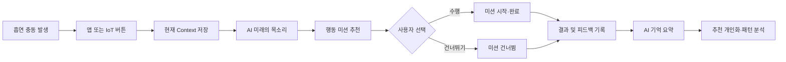
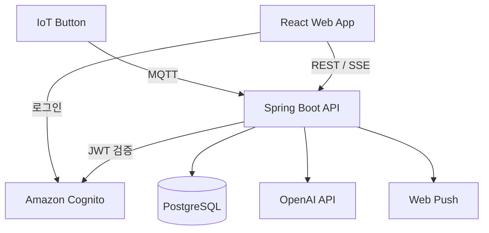

# NEXTiME

> 흡연 욕구를 행동으로 전환하는 맞춤형 AI 금연 보조 매니저

NEXTiME은 흡연 충동이 발생한 순간을 앱 또는 버튼형 IoT 디바이스로 빠르게 포착하고, 사용자가 진짜 원했던 미래의 보상과 지금 바로 실행할 수 있는 대체 행동을 제안합니다.

사용자의 목표와 과거 기록을 바탕으로 한 번의 충동을 넘길 수 있도록 돕고, 그 결과를 다음 추천에 반영해 사용자에게 맞는 금연 패턴을 만들어갑니다.

## 문제 정의

금연을 원하는 사람도 흡연 충동이 강해지는 순간에는 먼 미래의 건강보다 담배 한 개비의 즉각적인 보상을 선택하기 쉽습니다. 중요한 것은 의지의 부족을 지적하는 것이 아니라, 충동이 발생한 직후 사용자의 목표를 다시 가까이 보여주고 다른 행동으로 전환할 수 있도록 즉시 개입하는 것입니다.

NEXTiME은 이 짧은 개입 기회를 놓치지 않기 위해 다음 흐름을 제공합니다.

```text
흡연 충동 포착
  → 현재 욕구·장소·상황 기록
  → NEXT ME와 미래의 목소리 제시
  → 맞춤형 행동 미션 추천 및 수행
  → 흡연 여부와 미션 효과 기록
  → 다음 추천과 내 패턴 분석에 반영
```

## 핵심 기능

### NEXT ME

- 온보딩에서 흡연 습관, 금연 목표, 어려운 순간과 선호 행동을 수집합니다.
- AI가 사용자의 목표를 바탕으로 금연 후 바라는 모습을 담은 NEXT ME 카드를 생성합니다.
- 생성된 카드와 메시지를 홈 및 NEXT TIME 흐름에서 반복적으로 보여줍니다.

### NEXT TIME

- 앱 또는 MQTT 기반 IoT 버튼 이벤트로 NEXT TIME 세션을 시작합니다.
- 현재 흡연 욕구의 강도, 장소, 발생 계기를 기록합니다.
- AI가 개인 목표와 현재 상황에 맞는 `미래의 목소리`를 생성합니다.
- 정책 기반 추천 엔진이 현재 Context, 온보딩 선호, 과거 행동 결과를 바탕으로 행동 미션 1개를 추천합니다.
- 미션은 추천 직후 또는 수행 도중 건너뛸 수 있으며, 건너뛴 경우에도 결과 기록을 이어갈 수 있습니다.
- 이전 단계로 돌아가 상황을 다시 선택할 수 있도록 세션 rewind를 지원합니다.

### 결과 기록과 개인화

- 미션 수행 후 흡연 여부, 남은 욕구 강도, 미션 도움 정도와 자유 피드백을 기록합니다.
- AI가 기록을 다음 추천에 활용할 수 있는 기억 문장으로 요약합니다.
- 최근 3회의 행동 점수가 모두 최저점인 미션은 자동으로 추천에서 제외합니다.
- 설정에서 제외된 미션을 확인하고 다시 추천에 포함할 수 있습니다.

### 홈과 내 패턴

- 홈에서 오늘의 시도, 넘김·미룸·흡연 횟수와 다음 행동을 확인합니다.
- 빠른 흡연 기록으로 흡연 사실과 발생 계기를 즉시 남길 수 있습니다.
- 내 패턴에서 최근 7일의 주요 Trigger, 장소, 시간대와 효과적이었던 행동을 확인합니다.
- 분석에는 NEXT TIME 결과 기록을 사용하고, 최근/전체 기록 목록에는 NEXT TIME 기록과 빠른 흡연 기록을 함께 제공합니다.
- 분석 가능한 기록이 5건 미만이면 누적 기록 수와 데이터 부족 상태를 반환합니다.

### 인증·알림·디바이스

- Amazon Cognito Access Token을 사용하는 OAuth2 Resource Server 방식으로 API를 보호합니다.
- Web Push 구독을 등록하고 해제할 수 있습니다.
- MQTT 버튼 이벤트를 SSE로 전달해 웹 클라이언트가 실시간으로 반응할 수 있습니다.

## 서비스 흐름



## 기술 스택

| 영역 | 기술 |
| --- | --- |
| Frontend | React 19, Vite 8, React Router, styled-components, Axios, AWS Amplify |
| Backend | Java 21, Spring Boot 4.1, Spring MVC, Spring Security, Spring Data JPA |
| Database | PostgreSQL 17, Flyway |
| Authentication | Amazon Cognito, OAuth2 Resource Server, JWT |
| AI | OpenAI API, Mock Provider |
| IoT / Realtime | MQTT (Eclipse Paho), Server-Sent Events |
| Notification | Web Push |
| Deployment | Vercel, AWS EC2·S3·SSM, GitHub Actions |

## 아키텍처



백엔드는 기능 단위 패키지로 구성되어 있습니다. NEXT TIME 내부도 세션, 미래의 목소리, 추천, 미션 수행, 결과 기록으로 분리해 각 단계의 책임을 명확히 했습니다.

```text
NextTime/
├── backend/
│   └── src/main/java/com/nextime/
│       ├── ai/                 # NEXT ME·대처 프로필 AI 생성
│       ├── common/             # 공통 응답, 예외, 설정
│       ├── device/             # MQTT 버튼 이벤트와 SSE
│       ├── home/               # 홈 통합 조회
│       ├── mission/            # 미션 카탈로그·추천 제외 정책
│       ├── nexttime/
│       │   ├── session/        # 세션 생성·Context 저장·rewind
│       │   ├── futurevoice/    # AI 미래의 목소리
│       │   ├── recommendation/ # 정책 기반 미션 추천
│       │   ├── mission/        # 미션 시작·완료·건너뛰기
│       │   └── result/         # 결과 기록·AI 기억 요약
│       ├── pattern/            # 패턴 통합 분석
│       ├── push/               # Web Push 구독
│       ├── security/           # Cognito 인증
│       ├── smokingrecord/      # 빠른 흡연 기록·통합 기록 조회
│       └── user/               # 사용자·온보딩·설정
├── frontend/
│   └── src/
│       ├── api/                # 서버 API 클라이언트
│       ├── components/         # 공통 및 기능별 UI
│       ├── contexts/           # 전역 Context
│       ├── hooks/              # 인증·Push 등 공통 훅
│       ├── layouts/            # 화면 레이아웃
│       └── pages/              # 온보딩·홈·NEXT TIME·패턴·설정
├── infrastructure/             # 로컬 인프라 설정
└── docker-compose.yml          # PostgreSQL·Mosquitto
```

## 주요 API

모든 보호 API는 다음 인증 헤더를 사용합니다.

```http
Authorization: Bearer <Cognito Access Token>
```

| 기능 | Method | Endpoint |
| --- | --- | --- |
| 사용자 등록 | `POST` | `/users` |
| 내 정보 조회 | `GET` | `/users/me` |
| 금연 목표 수정 | `POST` | `/users/me/goal` |
| 추천 제외 미션 조회 | `GET` | `/users/me/excluded-missions` |
| 추천 제외 해제 | `DELETE` | `/users/me/excluded-missions/{missionId}` |
| NEXT ME 생성 | `POST` | `/ai/onboarding/next-me` |
| NEXT ME 조회 | `GET` | `/ai/onboarding/next-me` |
| 홈 조회 | `GET` | `/home` |
| NEXT TIME 세션 생성 | `POST` | `/next-time/sessions` |
| 현재 상황 저장 | `PATCH` | `/next-time/sessions/{sessionId}/context` |
| 세션 초기화 | `POST` | `/next-time/sessions/{sessionId}/rewind` |
| 미래의 목소리 생성 | `POST` | `/next-time/sessions/{sessionId}/future-voice` |
| 미션 추천 | `POST` | `/next-time/sessions/{sessionId}/recommendation` |
| 미션 시작 | `POST` | `/next-time/sessions/{sessionId}/mission/start` |
| 미션 완료 | `POST` | `/next-time/sessions/{sessionId}/mission/complete` |
| 미션 건너뛰기 | `POST` | `/next-time/sessions/{sessionId}/mission/skip` |
| 결과 기록 | `POST` | `/next-time/sessions/{sessionId}/result` |
| 빠른 흡연 기록 | `POST` | `/records/smoking` |
| 기록 목록 조회 | `GET` | `/records` |
| 기록 상세 조회 | `GET` | `/records/{recordId}` |
| 패턴 조회 | `GET` | `/patterns/overview` |

## 로컬 실행

### 요구 사항

- Java 21
- Node.js 20 이상
- Docker 및 Docker Compose
- Cognito User Pool 정보
- AI 기능을 실제로 호출하려면 OpenAI API Key

### 1. 저장소 받기

```bash
git clone https://github.com/NEXTiME-LikeLion/NextTime.git
cd NextTime
```

### 2. PostgreSQL과 MQTT 실행

```bash
docker compose up -d
```

기본 PostgreSQL 접속 정보는 다음과 같습니다.

```text
Host: localhost
Port: 5433
Database: nextime
Username: nextime
Password: nextime
```

### 3. 백엔드 환경변수 설정 및 실행

```bash
cd backend

export COGNITO_APP_CLIENT_ID="<Cognito App Client ID>"
export COGNITO_ISSUER_URI="<Cognito Issuer URI>"
export COGNITO_JWK_SET_URI="<Cognito JWK Set URI>"

# 실제 AI 응답을 사용할 때만 설정합니다.
export AI_PROVIDER="openai"
export OPENAI_API_KEY="<OpenAI API Key>"
export OPENAI_MODEL="gpt-5.4-mini"

./gradlew bootRun
```

AI 환경변수를 설정하지 않으면 기본 `mock` provider로 실행됩니다. 애플리케이션은 기본적으로 `http://localhost:8080`에서 동작하며, Flyway가 실행 시점에 데이터베이스 스키마와 초기 카탈로그를 적용합니다.

데이터베이스 설정을 변경하려면 다음 환경변수를 사용합니다.

```bash
export DB_URL="jdbc:postgresql://localhost:5433/nextime"
export DB_USERNAME="nextime"
export DB_PASSWORD="nextime"
```

### 4. 프론트엔드 실행

새 터미널에서 실행합니다.

```bash
cd frontend
npm install

export VITE_API_BASE_URL="http://localhost:8080"
npm run dev
```

Vite 개발 서버의 기본 주소는 `http://localhost:5173`입니다.

## 테스트와 빌드

### Backend

```bash
cd backend
./gradlew test --no-daemon
./gradlew bootJar --no-daemon
```

### Frontend

```bash
cd frontend
npm run lint
npm run build
```

## 배포

- Frontend는 Vercel에 배포합니다.
- Backend는 GitHub Actions에서 테스트와 JAR 빌드를 수행한 뒤, S3에 아티팩트를 업로드하고 AWS Systems Manager를 통해 EC2에 배포합니다.
- Backend 배포 후 `/actuator/health`로 상태를 확인합니다.
- 배포 환경에서는 `CORS_ALLOWED_ORIGINS`에 Vercel 도메인을 등록해야 합니다.
- API Key, DB 비밀번호, Web Push Private Key와 같은 민감 정보는 저장소에 커밋하지 않고 배포 환경의 Secret으로 관리합니다.

## 참고 자료

- 질병관리청, 「2025 지역사회건강조사 담배제품 사용 심층분석」
- Perski et al. (2023), Naughton et al. (2023): 흡연 충동 발생 이후 lapse까지의 시간과 실시간 개입 기회에 관한 연구
